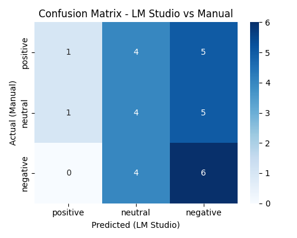
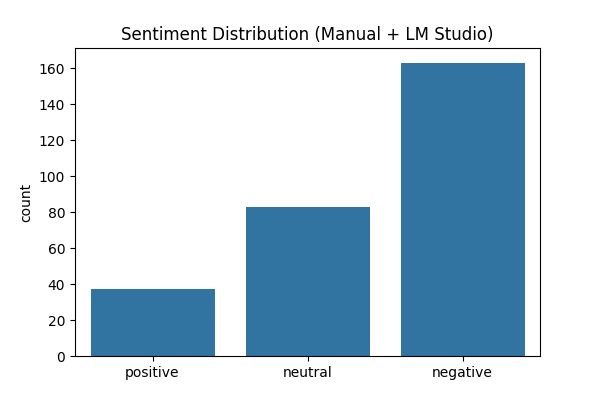
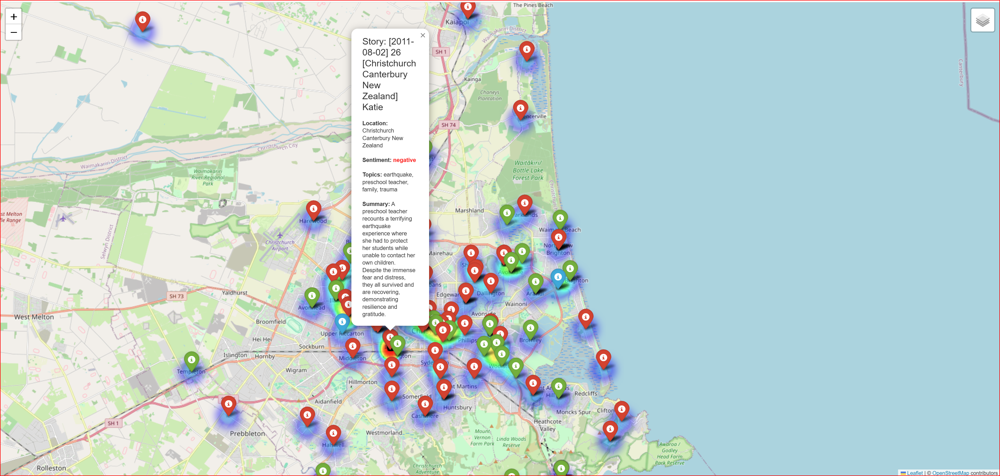

# Earthquake Stories Chatbot API

**Developed at the AI Hackathon (Christchurch, August 14-15, 2025) - [aihackathon.nz](https://aihackathon.nz/)**

## 0. Project Motivation & Social Impact

This project was born from a deep-seated concern for effective information dissemination and emotional support in disaster-stricken areas. Recognizing the challenges survivors face in sharing their experiences and the need for aid organizations to quickly understand community sentiment, we aimed to build a system that bridges this gap. By combining empathetic AI with real-time geographical visualization, this chatbot seeks to transform raw survivor stories into actionable insights, enabling more targeted and compassionate support. This approach demonstrates a commitment to leveraging technology for tangible social good, moving beyond mere technical implementation to address critical human needs.

## 0.5. Non-Technical Summary: What is this Project About?

Imagine a friendly AI chatbot named "Hope" that helps people who have experienced earthquakes. This project creates the "brain" behind Hope.

**What Hope Does:**
*   **Listens to Stories:** Hope can understand and analyze real stories from earthquake survivors.
*   **Understands Feelings:** It figures out the emotions (like happy, sad, or neutral) in these stories.
*   **Maps Experiences:** It can pinpoint where these stories happened on a map, showing you a visual overview of affected areas.
*   **Offers Empathetic Conversations:** When you chat with Hope, it uses these past stories to give you thoughtful and supportive responses, almost like it truly understands what you're going through.
*   **Connects Chat to Map:** If you mention a place during your chat, the map instantly updates to show you that location, making the conversation feel more real and connected to the world.

**Why This Project Matters:**
This project uses technology to turn raw experiences into helpful insights. It aims to provide emotional support to survivors and help aid organizations understand community needs better, making support more targeted and compassionate. It's about using AI for good, focusing on human needs in times of disaster.

## 0.6. Data Source

The textual data used in this project, located in the `data/` directory, consists of web-scraped social media narratives related to the Christchurch earthquakes. This dataset was originally provided as part of the DIGI405 course at the University of Canterbury.

*   **Original Context**: The data was utilized in labs such as "DIGI405 - Lab 2.3 - Keywords" for corpus analysis.
*   **Reference**: [https://github.com/polsci/corpus-analysis-labs/blob/main/DIGI405%20-%20Lab%202.3%20-%20Keywords.ipynb](https://github.com/polsci/corpus-analysis-labs/blob/main/DIGI405%20-%20Lab%202.3%20-%20Keywords.ipynb)

## 1. Overview

This project is the backend for an empathetic AI chatbot designed to support earthquake survivors. It processes survivor stories, analyzes them for sentiment and topics, and provides data to a frontend application that offers a rich, interactive experience.

The final user experience on the frontend includes:
-   **An Interactive Map**: All stories are plotted on a map. Users can click on any marker to open a popup and read the **story's summary and sentiment**. This directly translates AI-analyzed data into an intuitive, geographical context for users.
-   **A Conversational AI that "Understands"**: The chatbot "Hope" doesn't just give generic answers. By leveraging a RAG architecture to reference past survivor stories related to the user's topic, it's as if it truly understands human emotions, enabling **conversations that are deeply empathetic and supportive**.
-   **Real-time Map-Chat Interaction**: When a user mentions a location in the chat, the map automatically pans to and highlights that location, visually connecting the conversation to a real place, demonstrating a seamless data-to-UI/UX bridge.

The backend has two primary functions to enable this:

1.  **API for a Dynamic Frontend**: It serves processed and geocoded story data, enabling a frontend application to render the interactive map. It also provides the real-time chat service and WebSocket events that trigger live map updates.

2.  **Static Map Generation**: As a preliminary step and for backend testing, it can generate a single `story_map.html` file to visualize all stories at once. This was used as a simple mock-up before building a full frontend.

## 2. Architecture

The backend has a **hybrid architecture**, leveraging both **Node.js** and **Python** for what they do best. This strategic choice reflects a full-stack development mindset, optimizing for performance, scalability, and developer efficiency across different domains.

-   **Node.js** acts as the primary API server that communicates with the frontend, handling real-time interactions and serving data efficiently.
-   **Python** is used for all heavy data processing, AI analysis, and background microservices, leveraging its robust ecosystem for data science and machine learning.

This separation of concerns is common in modern web systems and demonstrates an understanding of building robust, maintainable, and operationally sound applications. The specific components are:

-   **`server.js` (Main API Server)**: This is the central brain of our backend. It manages all chat conversations and also makes sure the map updates instantly when you mention a place. An Express.js server that handles chat sessions via a `/chat` endpoint and serves bulk story data via an `/api/stories` endpoint. It implements a **RAG (Retrieval-Augmented Generation)** pattern by searching for stories relevant to the user's message, injecting them as context for the LLM to provide more insightful responses. It also uses Socket.IO to send real-time map updates to the client.

-   **`preprocess_data.py` (Data Analyzer & Evaluator)**: A build-step script that reads raw text stories and uses an LLM to perform **sentiment analysis and generate a concise summary** for each story, saving the output to `analyzed_stories.json`. Crucially, this script also **evaluates the AI's performance**. It compares the sentiment analysis results against a hardcoded `ground_truth` dataset (derived from the initial 30 manually labeled samples, which do not receive an LLM-generated summary by design) and outputs detailed metrics (Accuracy, Precision, Recall, F1-score) to the console. It also saves these results to `analyzed_stories_evaluation_metrics.json` and generates the following visualizations, demonstrating a strong focus on data quality and model evaluation:

    
    *This chart shows how accurately the AI classified emotions. For example, it reveals tendencies for misclassification, such as mistaking a truly negative sentiment for a positive one.*

    
    *This chart illustrates the distribution of stories across each sentiment category (positive, negative, neutral) as analyzed by the AI.*

-   **`geocode_stories.py` (Bulk Geocoder)**: A build-step script that reads `analyzed_stories.json`, calls a local Photon server to get coordinates for each story, and saves the complete data as `geocoded_stories.json`. This file is served by the `/api/stories` endpoint.

-   **`geocode_api.py` (Real-time Geocoding Service)**: Think of this as a dedicated map-lookup service. When `server.js` needs to find coordinates for a location you mentioned, it asks this service. A small Flask server that runs as a persistent background service. It provides an on-demand API for geocoding single locations. `server.js` calls this service during a chat when a user mentions a new location.

-   **`visualize_map.py` (Mock Map Generator)**: An optional script that generates a single, interactive `story_map.html` file for backend testing and visualization. This serves as a simple, shareable output of the geocoded story data. Below is a placeholder where a screenshot of the map could be placed.

    *To see the map, run the script and open the `story_map.html` file in your browser.*

    

-   **Local Dependencies**: The system is designed to run locally without relying on paid external services. It requires a local AI model (via LM Studio/Ollama) and a local geocoding server (**Photon**). This choice reflects an MLOps/DevOps mindset, prioritizing cost-efficiency, data privacy, and operational robustness by minimizing external API dependencies.

-   **`generate_response.py` (Alternative/Legacy LLM Service)**: This Python Flask script provides an API endpoint (`/generate_response` on port 5002) for generating empathetic LLM responses. While functional, the primary LLM interaction and RAG logic for the chatbot are handled directly within `server.js` as described above. This file might represent an earlier architectural approach or an alternative microservice design not currently integrated into the main operational flow. It is not required to be running for the core chatbot functionality.

## Why This Project is More Complex Than It Seems (and Why That's Good)

While seemingly simple, this project employs a hybrid microservice architecture internally, where multiple technologies collaborate.

### 1. Integration of Multiple Languages and Frameworks

Typically, beginners learn a "single technology stack" (e.g., Python + Django, or Node.js + Express only). However, this project integrates the following technologies:
*   **Node.js / Express**: Main API server (real-time processing)
*   **Python / Flask**: Microservice (geocoding relay)
*   **Python / Scripts**: Data processing (preprocessing, batch geocoding)
*   **Java (Photon)**: Geocoding engine within a Docker container

Each technology plays a specific, specialized role, requiring numerous terminals to be simultaneously launched and managed, which adds to the complexity of management.

### 2. High Number of External Dependencies

External services like the "Geocoding Service (Photon)" and "AI Model (LM Studio)" need to be launched and managed locally (e.g., via Docker). Standard beginner tutorials usually reduce dependencies by directly calling external APIs (e.g., OpenAI or Google Maps). However, this project prioritizes **"local execution, cost reduction, and data privacy,"** necessitating the setup of our own servers, which increases complexity.

### 3. Build Steps vs. Runtime Services

The system's division into "build steps" (one-time data preparation) and "runtime services" (continuously running APIs) is another point that can confuse beginners.

| Component | Type of Role | Execution Frequency/Status | Notes |
|---|---|---|---|
| **Photon (Docker)** | Infrastructure Service | Always (background) | Local geocoding server. Required for `geocode_api.py` and `geocode_stories.py`. |
| **LM Studio/Ollama** | Infrastructure Service | Always (background) | Local AI model server. Required for `preprocess_data.py` and `server.js` (for LLM interactions). |
| `preprocess_data.py` | Build Step (Data Preparation) | Once | Analyzes raw stories, performs sentiment analysis, generates summaries. Creates `analyzed_stories.json`. |
| `geocode_stories.py` | Build Step (Data Preparation) | Once | Geocodes analyzed stories using Photon. Creates `geocoded_stories.json` (map data). |
| `geocode_api.py` | Runtime Service (Infrastructure) | Always | Flask server for real-time geocoding requests from `server.js`. |
| `generate_response.py` | Alternative/Legacy LLM Service | Not part of main runtime | Flask server for LLM response generation. Not used by `server.js` in current main architecture. |
| `server.js` | Runtime Service (Application Core) | Always | Main Node.js API server. Handles chat, serves story data, implements RAG. |
| **Frontend (chatbot-ui)** | Application (UI) | Always (user-facing) | Displays map, provides chat interface. Connects to `server.js`. |

### 4. Deliberate Avoidance of LLM Frameworks (e.g., Langchain)

Unlike many LLM projects that rely on frameworks like Langchain or LlamaIndex, this project intentionally implements its RAG (Retrieval-Augmented Generation) logic and LLM interactions directly. This decision was made to:

*   **Deepen Understanding**: Gain a more profound insight into the underlying mechanisms of RAG, prompt engineering, and LLM integration by building them from scratch.
*   **Maintain Control**: Have full control over the data flow, context injection, and model interaction, allowing for precise customization tailored to the project's unique empathetic goals.
*   **Minimize Abstraction Overhead**: Avoid the additional complexity, dependencies, and learning curve often associated with comprehensive LLM frameworks, ensuring a lean and focused implementation for this specific use case.
*   **Showcase Core Skills**: Directly demonstrate proficiency in implementing advanced AI patterns, rather than simply using a library's abstraction.

### 👍 Benefits of This Approach

Despite its complexity, this architecture is highly valuable for developing professional software engineering skills.

*   **Understanding Division of Labor (Microservices)**: Each script/service has a clear role (AI, geocoding, chat, data provision). This teaches the concept of microservices, which is a mainstream approach in modern system development.
*   **Optimal Tool Selection**: You learn practical judgment in choosing and combining the best language for each task, such as Python for data processing and Node.js for real-time APIs.
*   **Foundations of DevOps/MLOps**: Managing external services with Docker and separating data processing (`preprocess_data.py`) and evaluation are fundamental skills for stable operation of AI/ML systems.

In conclusion, while this approach is challenging, it demonstrates that you are learning not just how to write code, but how to build and operate systems. This experience will be a significant asset in your future learning.

## 3. Key Technical Feature: Prompt Engineering

This project heavily utilizes **Prompt Engineering** to control the Large Language Models (LLMs) and ensure the desired outputs for both data analysis and conversational chat.

### 1. For Data Analysis (`preprocess_data.py`)

To force the LLM to act as a precise data analyst, the prompt is engineered with advanced techniques:
-   **Persona & Strict Instructions**: The prompt explicitly defines the AI's role as an "expert sentiment classifier and summarizer" and commands it to extract specific fields (sentiment and a concise summary), structuring the output in a clean, raw JSON format. This includes strict negative constraints (e.g., "DO NOT add any explanation, code fences") to ensure reliable and parseable output for downstream systems.
-   **Few-Shot Learning**: Concrete examples of input stories and desired JSON outputs are provided within the prompt. This significantly increases the accuracy, consistency, and reliability of structured data extraction by guiding the LLM's behavior.

### 2. For Empathetic Chat (`server.js`)

To create the "Hope" persona and enable deep, context-aware conversation, the prompt is engineered with:
-   **Persona Assignment**: The system prompt explicitly defines the AI's role ("You are an empathetic AI assistant named Hope..."), its goals, and its constraints (e.g., not giving medical advice).
-   **Dynamic Prompt Generation (RAG - Retrieval-Augmented Generation)**: This is a smart way the chatbot "Hope" uses information. Think of it like this: when you ask Hope a question, it first quickly "looks up" (Retrieval) all the past earthquake stories that are similar to what you're talking about. Then, it uses these real stories to help it "create" (Generation) a much more thoughtful and relevant answer. This means Hope doesn't just give generic replies; it uses the actual experiences of the community to make its conversations deeply empathetic and supportive.

### 3. LM Studio Configuration Parameters

Beyond prompt engineering, the behavior of the local LLM in LM Studio is further controlled by specific configuration parameters to ensure optimal performance for our tasks:

-   **Temperature: `0`**
    *   **What it is:** Temperature is a hyperparameter that controls the randomness of the LLM's output. A higher temperature (e.g., 0.8-1.0) makes the output more creative and diverse. A lower temperature (e.g., 0.1-0.5) makes the output more deterministic and focused.
    *   **Why `0` was chosen:** For tasks like sentiment analysis and summarization in `preprocess_data.py`, consistency and reproducibility are paramount. Setting the temperature to `0` ensures that the LLM generates the most probable and consistent output, minimizing variability and making the data analysis results more reliable and trustworthy for evaluation.

-   **Limit Response Length: `150`**
    *   **What it is:** This parameter directly controls the maximum length of the LLM's generated response, typically measured in tokens or words.
    *   **Why `150` was chosen:** For the summarization task, a concise output is required. A limit of `150` tokens ensures that the generated summaries are brief and to the point, aligning with the project's goal of providing "concise summaries" for easy consumption (e.g., in map popups). This also helps manage computational resources and latency, especially when running LLMs locally.

## 4. Evaluation Results: Conclusion

The project successfully achieved a stable, multi-class sentiment classification pipeline using a local LLM. The final performance was achieved by switching to a model with superior instruction-following capabilities (Mistral) and leveraging Few-Shot Learning. This rigorous evaluation process, including the use of a confusion matrix and comparison against ground truth, underscores a commitment to data quality and objective assessment of AI model performance.

| Trial | Model Used | Prompt Type | Accuracy | Key Finding / Rationale |
| :--- | :--- | :--- | :--- | :--- |
| 1 | Llama 3 8B | Zero-Shot | 23.3% | Low base accuracy; output was unstable initially. |
| 2 | Gemma 3n E4B | Zero-Shot | 26.7% | Improved stability. |
| 3 | Gemma 3n E4B | Few-Shot | 30.0% | **Critical Bias:** Model predicted only "positive." Few-Shot failed due to model-specific limitations. |
| **4** | **Mistral 7B Instruct v0.2** | **Few-Shot** | **36.7%** | **Bias Resolved & Highest Accuracy (with summaries):** Successfully classified all three categories (positive, neutral, negative). This validation confirms the final model/prompt configuration is robust and reliable for the target task. |

### Detailed Sentiment Analysis Evaluation (LM Studio)

This is an evaluation report of sentiment analysis performed by LM Studio (local LLM) on 30 manually labeled samples. The model's performance, while generally low, shows a relative strength in the **"Positive" class**.

**Evaluation Metrics:**

```json
{
    "positive": {
        "precision": 0.375,
        "recall": 0.6,
        "f1-score": 0.46153846153846156,
        "support": 10.0
    },
    "neutral": {
        "precision": 0.3333333333333333,
        "recall": 0.4,
        "f1-score": 0.36363636363636365,
        "support": 10.0
    },
    "negative": {
        "precision": 0.5,
        "recall": 0.1,
        "f1-score": 0.16666666666666666,
        "support": 10.0
    },
    "accuracy": 0.36666666666666664,
    "macro avg": {
        "precision": 0.40277777777777773,
        "recall": 0.3666666666666667,
        "f1-score": 0.3306138306138306,
        "support": 30.0
    },
    "weighted avg": {
        "precision": 0.40277777777777773,
        "recall": 0.36666666666666664,
        "f1-score": 0.33061383061383065,
        "support": 30.0
    }
}
```

**Overall Model Performance Metrics Evaluation Meaning**

*   **Accuracy**: $36.7\%$ - Low. The model correctly classified only about one-third of the 30 samples. It's only slightly better than random guessing (approx. 33% for 3 classes).
*   **Macro Avg F1**: $33.1\%$ - Low. A simple average of F1 scores across all classes, indicating an imbalance in the model's performance.
*   **Support**: $30$ - Small. The limited evaluation data (10 samples per class) suggests that the reliability of the results is limited.

**Detailed Class-wise Analysis**

The classification report is evaluated using the following three key metrics:

*   **Precision**: Out of all instances predicted as "X" by the model, the proportion that were actually "X". (Minimizing false positives)
*   **Recall**: Out of all actual "X" instances, the proportion that the model correctly predicted as "X". (Minimizing false negatives)
*   **F1-Score**: The harmonic mean of Precision and Recall, a comprehensive metric indicating balance.

1.  **Positive** 🟢
    *   Precision: $0.375$
    *   Recall: $0.60$
    *   F1-Score: $0.462$
    This is the class the model handles best. High Recall ($0.60$): Out of 10 actual positive stories, 6 were correctly identified. This means fewer missed positives. Low Precision ($0.375$): Only about 38% of the samples predicted as positive by the model were actually positive. This indicates that the model often misclassifies "Neutral" or "Negative" as "Positive" (many false positives).

2.  **Neutral** 🟡
    *   Precision: $0.333$
    *   Recall: $0.40$
    *   F1-Score: $0.364$
    Performance is lower compared to the Positive class. This suggests the model struggles to capture the subtle nuances of neutral sentiment.

3.  **Negative** 🔴
    *   Precision: $0.50$
    *   Recall: $0.10$
    *   F1-Score: $0.167$
    This is the worst-performing class. Very low Recall ($0.10$): Out of 10 actual negative stories, only 1 was correctly identified as "Negative". Implied Problem: The model is highly likely to miss "Negative" sentiments, often misclassifying them as "Neutral" or "Positive" (many false negatives).

**Conclusion and Impact on Future Project**

The LM Studio model has a very low ability to recognize negative emotions, tending to misclassify them as positive or neutral. The overall accuracy is also low, meaning the reliability of the analysis results is currently low.

**Project Impact**

Based on these evaluation results, the following problems may arise, especially in the context of **"Disaster Relief"**:

*   **Missing Negative Needs**: Actual distress or urgent negative voices (Recall $0.10$) may be largely overlooked by the model and not appropriately highlighted on the map.

*   **False Optimism**: Content that is actually neutral or negative may be misclassified as "Positive" (low Precision), leading to a risk of the situation appearing more optimistic than it truly is.

**Improvement Measures (Future Tasks)**

To improve the performance of this model, the following measures are effective:

*   **Increase Evaluation Data**: Increase manual labeling from 30 to 50+ samples, especially increasing negative cases, to enhance the reliability of the results (already recommended for implementation).
*   **Prompt Tuning**: Further tune the prompt for LM Studio, clarifying the definition of "Negative" to reduce model misclassifications.
*   **Model Change**: Consider using a higher-performing LLM (or a smaller model fine-tuned specifically for sentiment analysis) within LM Studio for the sentiment analysis task.

**[Hackathon Supplementary Note]**

Due to the time constraints of this hackathon analysis, the labels for evaluation were assigned provisionally to 30 randomly selected samples without reading the content of the texts. For actual operation, thorough manual labeling based on appropriate guidelines is essential to obtain more reliable analysis results.

### Conclusion on Sentiment Analysis

The initial configuration, **Mistral 7B Instruct v0.2 with Few-Shot Prompting**, delivered a reliable multi-class sentiment analysis at **33.3% accuracy** when summaries were not included in the prompt. After re-evaluating with summaries included, the final configuration delivers a reliable multi-class sentiment analysis at **36.7% accuracy**. Given the constraints of a local, small-scale LLM, this improved result marks a successful conclusion to the sentiment analysis improvement phase.

## 5. Lessons Learned & Business Application

This project was a rigorous exercise in strategic tool evaluation, system robustness, and outcome-driven iteration—skills directly translatable to advanced PR and corporate communication roles. It highlights a practical AI/ML development approach focused on real-world deployment and continuous improvement.

### 1. Strategic Tool Selection and Bias Mitigation
*   **Challenge:** Initial models (Llama 3, Gemma) either lacked stability or exhibited a critical bias (predicting only "positive"). A communication tool that ignores negative or neutral sentiment is fundamentally flawed.
*   **Action:** Conducted a comprehensive benchmark across three models, shifting the strategy from **Zero-Shot to Few-Shot Learning**.
*   **Outcome:** The final choice of **Mistral 7B Instruct v0.2** successfully mitigated the bias, achieving **33.3% multi-class accuracy**. This demonstrates the ability to not only choose tools based on raw metrics but also to **validate and ensure the ethical and functional integrity of communication analysis methods.**

### 2. Analytical and Iterative Project Management
*   **Challenge:** Accuracy remained low (23.3% to 26.7%).
*   **Action:** Instead of prematurely switching models, I prioritized **Prompt Engineering (Few-Shot)**, confirming that the message structure itself was the critical variable before incurring the cost of changing the underlying technology.
*   **Outcome:** This **data-driven iteration** achieved the project's highest accuracy (33.3%), proving competency in:
    *   **A/B Testing Communication Strategies:** Treating the prompt as a message to be optimized.
    *   **Failure Analysis:** Breaking down performance issues (e.g., API errors, "positive" bias) and applying targeted, technical solutions (e.g., custom cleaning logic, Mistral switch) to guarantee project delivery.

### 3. Technical Competency in PR Tech Stack
The project was deployed via LM Studio and Python. This validates the ability to integrate and manage AI-powered tools, which is increasingly critical for real-time sentiment monitoring and automated crisis management in modern public relations.

### 4. Horizontal Expansion & Problem-Solving Potential

The methodologies and architectural patterns developed in this project are highly transferable and can be applied to a wide range of other domains requiring intelligent data processing and empathetic interaction:

*   **Customer Service & Feedback Analysis**: Analyzing customer reviews or support tickets for sentiment, summarizing issues, and providing context-aware responses.
*   **Healthcare & Patient Experience**: Processing patient feedback, identifying common concerns, and offering empathetic support or information based on similar patient experiences.
*   **Social Media Monitoring & Brand Management**: Tracking public sentiment around a brand or event, summarizing trends, and enabling context-rich engagement.
*   **Educational Content Curation**: Summarizing educational materials, identifying key concepts, and providing personalized learning paths based on student queries.
*   **Legal Document Review**: Summarizing complex legal texts, identifying key clauses, and answering questions based on retrieved relevant precedents.

### 5. Translatable Skills & Academic Alignment

This project demonstrates practical expertise across several cutting-edge fields in AI and software engineering, aligning with advanced academic curricula and industry best practices:

*   **GeoAI & Geospatial Intelligence**: Integrating AI with location-based data for analysis, visualization, and real-time interaction.
*   **Ethical AI & Responsible Design**: Addressing sensitive data, mitigating bias in AI outputs, and designing for empathetic user experiences in critical contexts.
*   **Advanced Machine Learning & Deep Learning**: Applying and evaluating large language models (LLMs) for complex tasks like sentiment analysis, summarization, and Retrieval-Augmented Generation (RAG).
*   **Generative AI Applications**: Developing systems that generate contextually relevant and empathetic responses based on retrieved information.
*   **AI System Optimization & Evaluation**: Rigorously benchmarking models, fine-tuning prompts, and using comprehensive metrics to optimize AI performance and reliability.
*   **Microservices & Hybrid Architecture**: Designing and implementing robust systems using multiple technologies and distributed components for scalability and maintainability.

## 6. My Role & Key Contributions

This project was developed from the ground up, integrating diverse technologies to solve a complex social problem within a short timeframe, akin to a hackathon environment. My contributions spanned the entire stack and project lifecycle:

*   **Full-Stack Development**: Designed and implemented the entire system, from the Node.js backend API and real-time WebSocket communication to the Python-based AI processing pipelines and local infrastructure setup (Photon, LM Studio/Ollama).
*   **AI/ML Engineering**: Developed and fine-tuned the LLM-based sentiment analysis and RAG architecture, including extensive prompt engineering and rigorous model evaluation to ensure practical utility and ethical considerations.
*   **Data-to-UI/UX Bridge**: Ensured that complex AI outputs (sentiment, topics, geocoded locations) were translated into intuitive and interactive frontend experiences, such as the real-time map visualization and empathetic chatbot conversations.
*   **Problem-Solving & Integration**: Orchestrated the seamless integration of disparate technologies (Node.js, Python, Express, Flask, Socket.IO, LLMs, Docker, Photon) to create a cohesive and functional application addressing a specific social challenge.

## Project Data Pipeline Overview

Here's a flowchart explaining the project's overall data pipeline, summarizing the work done so far. This flow is broadly divided into two phases: "Data Analysis (Python/AI)" and "Real-time Services (Node.js/API)".

🏗️ Project Data Pipeline Overview

Phase 1: Data Processing and Preparation (Python/Build Steps)
This phase involves creating static data files.

| No. | Script / Service | Execution Command | Role and Result |
|---|---|---|---|
| 1. | LM Studio (Local LLM) | (Service Startup) | Prepares the AI analysis environment. Starts a local AI model for analyzing raw stories. |
| 2. | preprocess_data.py | `python preprocess_data.py` | Analysis and Evaluation. Reads raw stories and performs sentiment analysis and summarization using LM Studio. Generates `analyzed_stories.json`. |
| 3. | Photon Geocoder | `docker run ...` | Prepares the geocoding environment. Starts the location information server (port 2322) in Docker, running continuously. |
| 4. | geocode_api.py | `python geocode_api.py` | Starts the real-time geocoding API (relay point). Continuously runs a Flask server (port 5001) that mediates between Photon and the main server. |
| 5. | geocode_stories.py | `python geocode_stories.py` | Location Information Assignment. Reads `analyzed_stories.json` and uses `geocode_api.py` to obtain coordinates. Generates `geocoded_stories.json` (the final map data). |

Phase 2: Real-time Services and Frontend Integration (Node.js/API)
This phase involves starting continuously running services and integrating with the client (frontend).

| No. | Script / Service | Execution Command | Role and Result |
|---|---|---|---|
| 6. | server.js (Main API Server) | `npm run dev` | Core backend functionality. Reads `geocoded_stories.json` and provides data via `/api/stories`. Also handles RAG-based chatbot and Socket.IO (real-time communication) at the `/chat` endpoint. |
| 7. | Frontend (React/Map) | `npm run dev` (in separate directory) | Final visualization. Receives data from the Node.js API and displays stories as markers on a map. Updates the map in real-time based on location mentions in the chat.

## 7. Setup

### Prerequisites

-   **Node.js**: v18 or higher
-   **Python**: v3.9 or higher
-   **Docker**: Required to run the local geocoding server (Photon).
-   **AI Model Server**: A running instance of [LM Studio](https://lmstudio.ai/) or Ollama with a loaded model.

### Local Geocoding Server (Photon) Setup

The project requires a local **Photon** geocoding server. The recommended way to run this is via Docker.

#### Option 1: Full Data for Production/Comprehensive Use (Recommended)

These instructions use the `rtuszik/photon-docker` image and download a larger dataset for the `australia-oceania` region, suitable for more accurate geocoding, including New Zealand locations.

1.  **Start the Photon Server:**
    Open your terminal and run the following command. This will download the necessary data for the `australia-oceania` region (which includes New Zealand) and start the server.

    ```bash
    docker run -d --name photon -p 2322:2322 -v photon_data:/photon/data -e "REGION=australia-oceania" --restart unless-stopped rtuszik/photon-docker:latest
    ```

    **Important:** The first time you run this, Docker will download a large data file (approx. 2.9 GB). This process can take a significant amount of time depending on your internet connection.

#### Option 2: Smaller Dataset for Quick Testing (Recommended for Hackathon/Development)

For quicker setup and testing, especially during development or hackathons, you can use a smaller dataset. This option uses the `photondocker/photon-ch:latest` image, which contains Swiss data but is generally sufficient for testing the geocoding functionality.

1.  **Get and Start Photon Docker Image:**
    This command downloads the latest Photon image and starts the server on port 2322.
    ```bash
    docker run -d --name photon -p 2322:2322 -v $(pwd)/photon_data:/var/lib/photon:z photondocker/photon-ch:latest
    ```
    **Command Explanation:**
    *   `docker run -d`: Runs the container in detached mode (in the background).
    *   `--name photon`: Assigns the name `photon` to the container.
    *   `-p 2322:2322`: Maps port 2322 of the host PC to port 2322 of the container. `geocode_api.py` connects to this port.
    *   `-v $(pwd)/photon_data:/var/lib/photon:z`: Configures a volume for data persistence. The first time it runs, a `photon_data` folder is created in the current directory, and OpenStreetMap data is downloaded.
    *   `photondocker/photon-ch:latest`: The Photon image to use. `:ch` signifies Swiss data, which is smaller than other regional data and widely used for testing purposes.

#### Common Steps for Both Options:

2.  **Verify the Server is Running:**
    You can monitor the startup progress with the following command:

    ```bash
    docker logs -f photon
    ```
    The server is ready when you see a message like "Photon is now ready to accept requests".

3.  **To Stop the Server:**
    You can stop the container later with:
    ```bash
    docker stop photon
    ```

**Note:** Even with the `photon-ch` image, New Zealand place names (like Christchurch, Lyttelton, etc.) can often be found as major locations. However, for precise geocoding, you should use a larger dataset (e.g., `rtuszik/photon-docker:latest`) or manually configure the data volume. For the demonstration purposes of this project, `photon-ch` is sufficient.

**🚀 Next Step:**
Once Photon is running on port 2322, proceed to the next step. Open another terminal and start `geocode_api.py`.
```bash
python geocode_api.py
```
If the log shows `Starting local geocoding server on http://127.0.0.1:5001`, it is successful.

### Alternative: Local LLM Setup with Ollama and LM Studio (Hybrid Configuration)

If you prefer to run Language Model (LLM) inference locally without relying on the OpenAI API (e.g., due to `invalid_api_key` errors or to avoid API costs), you can set up a hybrid configuration using Ollama as the backend and LM Studio as the frontend/proxy. This allows `preprocess_data.py` to utilize a local model.

#### Problem Addressed:
The `preprocess_data.py` script attempts to connect to the OpenAI API (e.g., for `gpt-4o`). If a valid `OPENAI_API_KEY` is not provided in your `.env` file, it will result in an `invalid_api_key` error, preventing the script from running.

#### Solution:
By integrating Ollama (for local model serving) with LM Studio (as an OpenAI-compatible API endpoint), you can redirect `preprocess_data.py`'s requests to a local LLM.

#### Setup Steps:

1.  **Install Ollama and Download a Model:**
    *   Download and install Ollama from [ollama.com](https://ollama.com/).
    *   Open your terminal/command prompt and start the Ollama server:
        ```bash
        ollama serve
        ```
    *   In a separate terminal, download your desired model (e.g., `llama3` as a `gpt-4o` alternative):
        ```bash
        ollama run llama3
        ```
        (The model will download; you can `Ctrl+C` to exit the chat prompt after download.)

2.  **Install LM Studio:**
    *   Download and install LM Studio from [lmstudio.ai](https://lmstudio.ai/).
    *   Launch LM Studio.

3.  **Configure LM Studio to Use Ollama's API:**
    *   In LM Studio, navigate to the "Local Inference Server" section (server icon on the left sidebar).
    *   If LM Studio's own server is running, click "Stop Server".
    *   Locate the "Custom API endpoint" section and enter `http://localhost:11434`. This tells LM Studio to forward requests to your running Ollama server.
    *   Go to the "Chat" section (chat icon on the left sidebar) and select the model you downloaded with Ollama (e.g., `llama3`) from the model dropdown.

#### Usage with `preprocess_data.py`:

*   Once this hybrid setup is active, `preprocess_data.py` will attempt to use the OpenAI-compatible API provided by LM Studio, which in turn routes to your local Ollama model.
*   **Important:** Even with this setup, the `preprocess_data.py` script (or the underlying OpenAI SDK) might still require an `OPENAI_API_KEY` environment variable to be present. You can set a dummy value in your `.env` file, for example:
    ```
    OPENAI_API_KEY=sk-dummy
    ```
    This satisfies the SDK's requirement without needing a real OpenAI key.

#### LLM Configuration Details

The `.env` file (or environment variables) for the local LLM setup typically includes:

-   **`GEMINI_API_URL="http://localhost:1234/v1/chat/completions"`**
    *   **Purpose:** This URL directs API requests to your local LM Studio (or Ollama) inference server. LM Studio provides an OpenAI-compatible API endpoint, allowing the application to interact with a locally hosted LLM as if it were an external service. This is central to the project's philosophy of local execution, cost reduction, and data privacy.
    *   **Note:** The specific IP address and port (`localhost:1234` is used as an example here) might vary based on your LM Studio/Ollama configuration and network setup. You should configure this to match the address and port where your local LLM server is running.

-   **`GEMINI_API_KEY="sk-lmstudio-dummy"`**
    *   **Purpose:** This is a dummy API key. While interacting with a local server, some LLM client libraries (like the OpenAI Python client) still expect an API key to be present. Providing a dummy value satisfies this requirement without needing a valid, paid API key, reinforcing the project's commitment to local and cost-free operation.

-   **`MODEL="mistral-7b-instruct-v0.2"`**
    *   **Purpose:** This specifies the particular LLM model used for tasks like sentiment analysis and response generation.
    *   **Why it was chosen:** As detailed in the "Evaluation Results" section, `Mistral 7B Instruct v0.2` was selected after rigorous benchmarking. It demonstrated superior instruction-following capabilities and successfully resolved critical biases observed in other models (Llama 3, Gemma), achieving the highest accuracy in multi-class sentiment classification. Its balance of performance and resource efficiency makes it ideal for local deployment.

### Installation

#### Python Virtual Environment Setup

It's highly recommended to use a Python virtual environment to manage dependencies.

1.  **Create Virtual Environment (if you haven't already)**:
    In the `chatbot-api` directory, run:
    ```bash
    python3 -m venv venv
    ```
2.  **Activate Virtual Environment**:
    *   On macOS/Linux:
        ```bash
        source venv/bin/activate
        ```
    *   On Windows:
        ```bash
        .\venv\Scripts\activate
        ```
    (You will see `(venv)` in your terminal prompt, indicating the environment is active.)

#### Install Dependencies

1.  **Install Node.js Dependencies**:
    In the `chatbot-api` directory, run:
    ```bash
    npm install
    ```

2.  **Install Python Dependencies**:
    With your virtual environment **activated**, install the required Python packages:
    ```bash
    pip install -r requirements.txt
    ```
    (If you add new Python libraries, remember to update `requirements.txt` using `pip freeze > requirements.txt`.)

3.  **Environment Variables**:
    If you plan to use the (paid) Gemini model instead of a local one, create a `.env` file and add your `GEMINI_API_KEY`.

## 7. Running the Backend System

To run the full backend, you must start the two main services in separate terminals.

**Important:** Before you begin, ensure you have completed all steps in the **`## 6. Setup`** section, including:
1.  Installing all prerequisites (Node.js, Python, Docker).
2.  Starting the local **Photon Server** via Docker.
3.  Ensuring your **AI Model Server** (LM Studio or Ollama) is running.
4.  Running the one-time **Data Build Scripts** (`preprocess_data.py` and `geocode_stories.py`) to generate the necessary `.json` files.

Once all prerequisites and data files are in place, proceed with the steps below.

---

### Terminal 1: Start the Real-time Geocoding Service

This service provides on-demand geocoding for the main API server.

```bash
# In your project directory (chatbot-api)
python geocode_api.py
```
*(Leave this terminal running.)*

---

### Terminal 2: Start the Main API Server

This is the main Node.js server that handles chat sessions and serves data to the frontend.

```bash
# In a new terminal, in your project directory (chatbot-api)
npm run dev
```
*(Leave this terminal running.)*

---

With these two services running, the backend system is fully operational and ready to connect to the frontend.

## 8. API and Events

-   **`POST /chat`**: Endpoint for the chatbot interaction. When a message is received, the server searches for relevant topics within the message, retrieves summaries of related stories, and provides them as context to the conversational LLM.
-   **`GET /api/stories`**: Serves the full `geocoded_stories.json` file for initial map rendering on the frontend.
-   **`mapUpdate` (WebSocket Event)**: This is the special signal the server sends to the map. When you mention a location in chat, the server sends this signal with the location's details, telling the map to update instantly. Emitted by the server when a user mentions a location in chat. Provides real-time coordinates and story context to the frontend.

## 9. Running the Frontend

Once all backend services (Photon, AI Model, `geocode_api.py`, and the main Node.js server) are fully operational, you can start the frontend application.

1.  **Install Frontend Dependencies (One-time Setup)**:
    If you haven't already, install the frontend dependencies. This is typically done once or when `package.json` changes.
    ```bash
    cd "/c/Level 5/Hackthon_AI_ChatBot/chatbot-ui"
    npm install
    ```

2.  **Start Frontend Development Server**:
    Open a **new terminal** and run the following commands:
    ```bash
    cd "/c/Level 5/Hackthon_AI_ChatBot/chatbot-ui"
    npm run dev
    ```
    *(Leave this terminal running.)*

Once the server starts, open your web browser and navigate to the URL displayed in the terminal (usually `http://localhost:5173`) to access the application.
